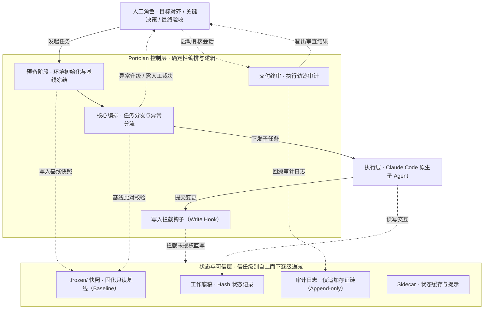
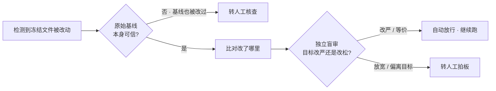
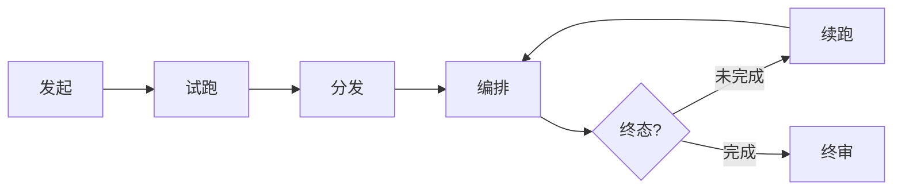

# Portolan

<div align="center">

> 长程任务插件：A plugin for long-horizon agent tasks.

[安装](#安装) · [快速上手](#快速上手) · [工作原理](#工作原理) · [Roadmap](#roadmap)

</div>

Portolan 是中世纪为远洋航行绘制的海图——这个插件为 agent 的长程任务导航。

---

## 长程任务为什么需要 Harness

各家厂商都在提升 agent 长程任务的表现。半年前 agent 自主执行的续航还比较有限，现在已能跨数十轮、持续数小时完成复杂工程。长程自主是公认的下一个能力前沿。

但模型越强、跑得越远，三个结构性问题越突出：

| 问题 | 表现 |
|---|---|
| **目标漂移** | 执行到中段，agent 悄悄把目标改简单或偏离原意 |
| **提前退出** | 没做完的说做完了，中途中断任务 |
| **验证缺失** | 任务执行完成后缺乏可靠的独立验证 |

仅靠模型进步不够——这三件事是结构问题。模型越聪明，跑偏了越难追，提前退出越能自圆其说。

长程任务要可靠完成，模型和 Harness 缺一不可。模型负责执行，Harness 负责管控。

Portolan 是一个 Claude Code 插件，专门强化长程任务中的任务需求确认、持续执行、终态判定和独立验收。

## 安装

> ⚠️ **Beta（v0.1.0）**：核心流程已跑通验收，接口、文件格式可能调整。

Portolan 是 [Claude Code](https://docs.anthropic.com/en/docs/claude-code) 插件，需要 Claude Code 运行环境。

Claude Code 里两步：

```
/plugin marketplace add KKL08/Portolan
/plugin install portolan@portolan
```

另需 Python 3.10+（`state-guard` 用到 `fcntl`，仅 macOS / Linux）和 PyYAML。

## 快速上手

一句话发起任务：

```
/portolan:long-horizon-task 你的任务目标和需求
```

Portolan 追问关键问题，敲定成功画像、验收命令，冻结任务清单，派 subagent 执行。跑完后开新会话终审：

```
/portolan:finish
```

## 工作原理

### 分层架构



### 异常信号分诊



### 运行流程



| 阶段 | 做什么 |
|---|---|
| **发起** | 摸底任务、定验收清单、选评估策略、冻结任务清单 |
| **试跑** | 分发前先小范围试跑，验证执行计划可行 |
| **分发** | 组装执行规程，冻结任务清单 |
| **编排** | 状态持久化跨上下文边界，代码判定终态；哈希信号先分诊，等价、收紧自动追认继续跑，放松、改向转人工；中断时带上下文自动恢复 |
| **续跑** | 审批、阻塞、无进展等停点，人来拍板 |
| **终审** | 干净会话盲验 + 程序审计（含追认轨迹审计） |

### 三个入口

| 命令 | 用途 |
|---|---|
| `/portolan:long-horizon-task` | 发起全流程 |
| `/portolan:continue` | 停点续跑 |
| `/portolan:finish` | 终审验收 |

**`/portolan:long-horizon-task`** — 全流程发起。收到任务后先摸底，判断是否需要长程装备，追问关键问题和你对齐成功画像，确认验收命令，签署并冻结任务协议单。之后进入试跑、分发、编排执行。准备阶段由你和 Portolan 协作完成。执行阶段，任务状态持久化到 sidecar，跨上下文刷新不丢失。终态由 state-guard 判定：逐项核验证据、校对哈希、检查清单翻转，全部通过才放行。执行中断或失败时，带完整上下文包自动恢复，不从头重来。

**`/portolan:continue`** — 停点续跑。执行中遇到需要审批、被外部阻塞、原地打转等情况，Portolan 会停下来喊你回来。哈希信号分诊到放松或改向、或执行者提了变更提案，停点会把诊断结果或提案摆出来，你批准、拒绝或搁置。你拍板后从停点继续，不必重跑已完成的部分。支持原会话热恢复和新会话冷启动两条路径。

**`/portolan:finish`** — 独立终审。开一个**干净会话**，不带执行期上下文，**亲自重跑**验收命令，不采信执行者自报的结果。同时做程序审计：核对冻结哈希、检查证据完整性、跑 audit-chain 核对追认链衔接和停点窗口，抓漏改与伪造审批。

> **finish 可以单独使用。** 即使任务不是 Portolan 发起的，只要有一份任务协议单和验收清单，`/portolan:finish` 就能对它做独立验收。适合给任何 agent 完成的工作加一道隔离复核——换会话、换上下文、亲自跑一遍，比让同一个 agent 自证可靠得多。

### 核心保证

几条硬约束不靠 agent 自觉，靠代码强制：

- **哈希冻结** — 目标、验收标准开工时存 SHA-256 哈希，中途改了立刻留痕
- **冻评分标准** — 判分逻辑、期望答案一起冻住，agent 改不了考卷
- **写保护** — 执行期内，hook 拦截常规写路径（Write/Edit/Bash）对冻结文件和 `.frozen/` 快照的直接写入；绕开工具直改，会被下一次哈希校验或 audit-chain 事后抓到
- **信号分诊** — 哈希不匹配只是信号，不是篡改定论：先校验快照有没有被一起动过手脚，再对比 diff，再盲审判定改动方向。等价、收紧的改动自动追认继续跑；放松、改向才转人工。`manual` 模式下所有信号一律转人工，不走盲审
- **变更提案通道** — 执行者发现目标或方案不对，不能直接改冻结文件，只能写结构化提案挂"需批准"，等人批了才用 amend-freeze 入账
- **轨迹审计** — finish 跑 audit-chain：核对每条追认的哈希是否逐条衔接、时间戳是否落在停点窗口内，有没有未经人批的放松改动，并给出冻结基线到当前的全量 diff
- **独立终审** — finish 在干净会话里亲自重跑验收命令，不采信执行者自报
- **纯代码判定** — 能不能停、证据是否合规、哈希是否完整，全走确定性逻辑

执行交给 Claude Code 原生 subagent，Portolan 只管准备、分发、验收——不造第二套执行引擎。

## Roadmap

- [ ] Codex 等平台适配
- [ ] Loop 沉淀与复用机制
- [ ] 跨 agent harness 协作
- [ ] 主动伴随式监督机制
